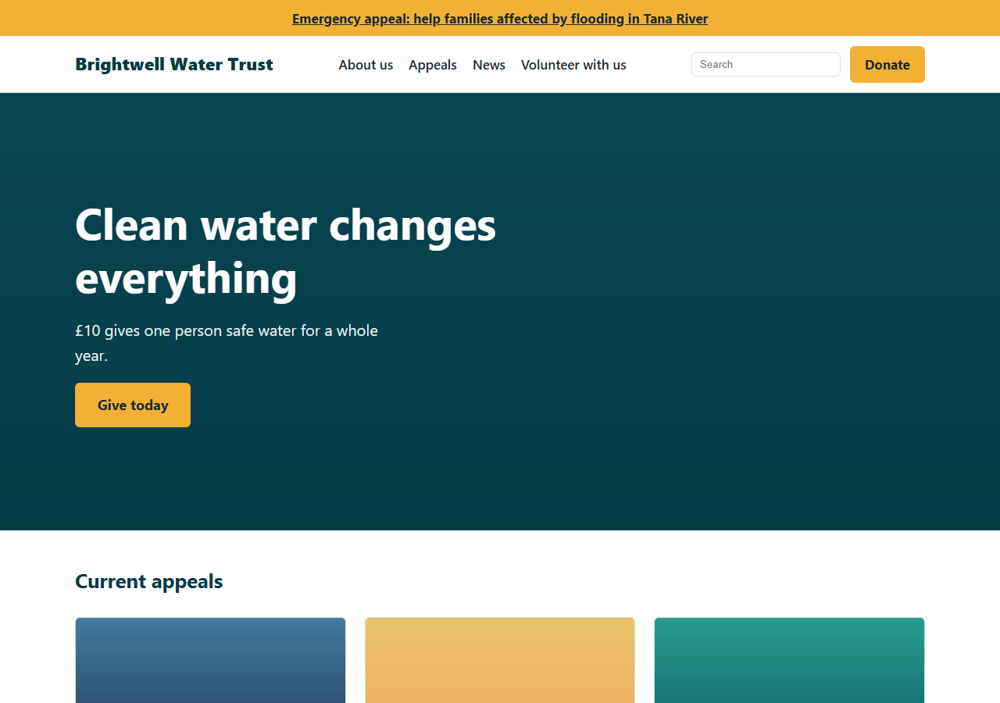
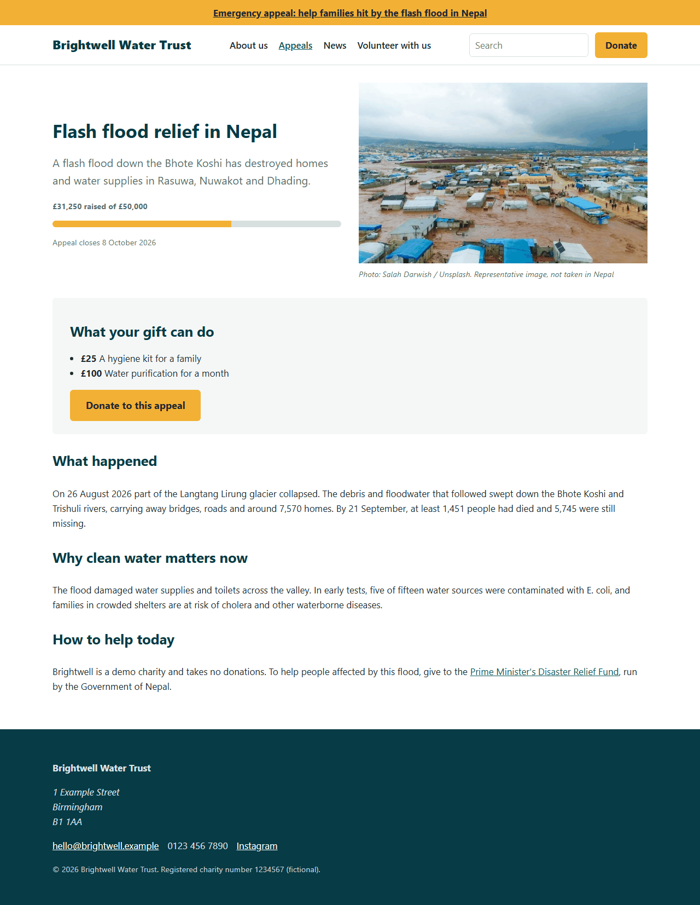
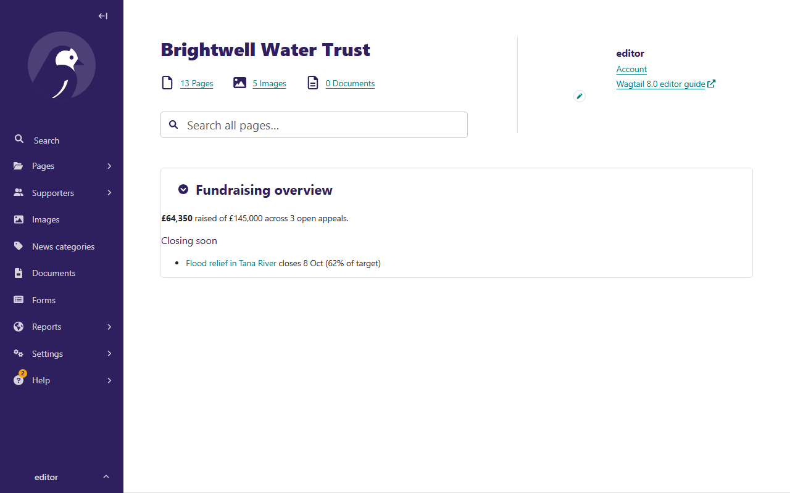

# Charity Wagtail CMS

A content-managed website for **Brightwell Water Trust**, a fictional water charity, built with
Django 6.1 and Wagtail 8.0. Editors run fundraising appeals, news, forms and site-wide messages
from the Wagtail admin. Every feature was built test-first with pytest.



## Quick start

Requires Python 3.13+ and [uv](https://docs.astral.sh/uv/).

```bash
uv sync
uv run python manage.py migrate
uv run python manage.py seed_demo          # fictional charity content, safe to re-run
uv run python manage.py createsuperuser
uv run python manage.py runserver
```

Site: <http://localhost:8000> · Admin: <http://localhost:8000/admin/> · API: <http://localhost:8000/api/v2/pages/>

## What editors can do

| Area | What it does | Wagtail features |
|---|---|---|
| Page building | Compose pages from headings, rich text, images with photo credits, quotes, impact statistics, calls to action, video, tables, document downloads, testimonials and partner logos | `StreamField`, `StructBlock`, `ListBlock`, custom block validation and templates |
| Appeals | Target, amount raised, dates and suggested gifts; progress bars; open/closed filters; homepage features open appeals | Page models, `InlinePanel` + `Orderable`, `TabbedInterface`, custom `PageQuerySet`, preview modes |
| News | Stories with tags and editor-managed categories; tag, category and RSS URLs | `RoutablePageMixin`, `ClusterTaggableManager`, `ParentalManyToManyField` |
| Forms | Build volunteer and enquiry forms, receive email (Reply-To the sender), export submissions to CSV | `wagtail.contrib.forms` |
| Supporters | Partners (drag to reorder) and testimonials with drafts, revisions, locking and preview | Snippets, `SnippetViewSet(Group)`, `DraftStateMixin`, `RevisionMixin`, `PreviewableMixin` |
| Site-wide | Charity number, contact details, donate page, social links, emergency-appeal banner | `wagtail.contrib.settings` (site and generic settings) |
| Images | Photo credit and a safeguarding consent flag on every image, which keeps unconsented images out of the API; focal-point crops; alt text from the image description | Custom image model, renditions, custom API viewset |
| Search | Full-text search over page content, excluding drafts and private pages; editor-pinned results | `search_fields`, `wagtail.contrib.search_promotions` |
| SEO | Sitemap, robots.txt, canonical and Open Graph tags, social sharing image, redirects (including automatic ones on slug change) | `wagtail.contrib.sitemaps`, `wagtail.contrib.redirects`, promote panels |
| Headless | Read-only JSON for pages, images and documents, e.g. for a mobile app | `wagtail.api.v2` |
| Admin | "Highlight" rich text button, fundraising dashboard panel, moderation workflow, scheduled publishing | Hooks, Draftail features, dashboard components, workflows |

| Campaign page | Admin dashboard |
|---|---|
|  |  |

## Project layout

```
charity/     project settings (base / dev / test / production), URLs, API router, base templates
core/        shared StreamField blocks, custom image model, snippets, site settings, SEO, admin hooks
home/        HomePage, StandardPage, seed_demo command
campaigns/   fundraising appeals, dashboard panel
news/        news index (routable) and stories
contact/     editor-built form pages
search/      search view with promoted results
```

Dependencies point one way: feature apps depend on `core`, and `core`'s code never imports them
(a test enforces this). `core` has no page types of its own, so its tests render pages from `home`
and `campaigns`.

## Testing and quality

```bash
uv run pytest
uv run pytest --cov            # with coverage
uv run ruff check . && uv run ruff format --check .
```

- Tests use pytest-django, [wagtail-factories](https://github.com/wagtail/wagtail-factories) and
  Wagtail's form-data helpers to exercise the real admin editing flow, not just models.
- `seed_demo` has a smoke test that renders every page it creates.
- GitHub Actions runs lint, `makemigrations --check`, Django's `check --deploy` against
  production settings, and the test suite on every pull request.

## Deployment notes

Production settings (`charity.settings.production`) read configuration from the environment.
The Docker image selects them with `DJANGO_SETTINGS_MODULE`; anywhere else, set that variable
yourself, because `manage.py` and `wsgi.py` fall back to the dev settings.

| Variable | Purpose |
|---|---|
| `DJANGO_SECRET_KEY` | Required; the app refuses to start without it |
| `DJANGO_ALLOWED_HOSTS` | Required; comma-separated hostnames. The app refuses to start without it |
| `DJANGO_CSRF_TRUSTED_ORIGINS` | Comma-separated origins, e.g. `https://example.org` |
| `WAGTAILADMIN_BASE_URL` | Base URL used in admin notification emails |
| `DJANGO_SECURE_HSTS_SECONDS` | HSTS duration; defaults to one hour until HTTPS is confirmed |
| `DJANGO_EMAIL_HOST` | SMTP server for form notifications and workflow emails. If it's unreachable, submissions are still saved and the error is logged |
| `DJANGO_EMAIL_PORT`, `DJANGO_EMAIL_USE_TLS` | Defaults: `587` and `true` |
| `DJANGO_EMAIL_HOST_USER`, `DJANGO_EMAIL_HOST_PASSWORD` | SMTP credentials |
| `DJANGO_DEFAULT_FROM_EMAIL` | Sender address for workflow and error emails |
| `DJANGO_DATA_DIR` | Directory for `db.sqlite3` and uploaded media; must be persistent storage. The Docker image uses a `/data` volume |
| `DJANGO_SERVE_MEDIA` | `true` serves uploads from Django (the Docker image's default). Turn it off when a web server or object storage serves `/media/` |

Static files are compressed and served by [WhiteNoise](https://whitenoise.readthedocs.io/), so
no separate web server is needed for them.

Scheduled publishing needs a cron job running `python manage.py publish_scheduled` every few
minutes, with the same environment as the web process. The Dockerfile is based on the Wagtail
project template; CI builds it and runs Django's deployment checks inside the image.

## Notes

- Brightwell Water Trust, its people, figures and charity number are fictional.
- Built with a feature-branch workflow; see the merged pull requests for the history of each feature.
