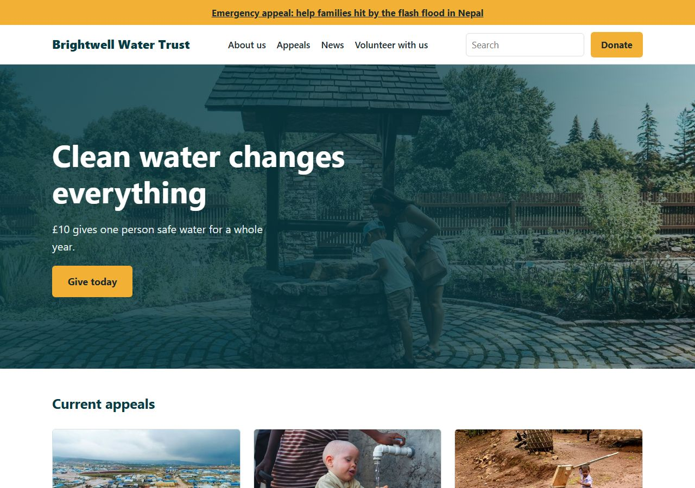

# Charity Wagtail CMS

A website and content management system for small charities in Nepal and the UK, built with
Django 6.1 and Wagtail 8.0. Supporters read appeals and news, pledge a gift and volunteer, in Nepali
or English; the charity's team runs it all from the Wagtail admin. The demo charity, **Brightwell
Water Trust**, is fictional.

These docs are for anyone who works on the site, and for AI agents doing the same. They're plain
Markdown in the repo's `docs/` folder, so they read the same on GitHub as on the built site, and
the build publishes `llms.txt` and `llms-full.txt` for AI agents. Each part of the site is
described on one page, well enough to rebuild it.



## Where to start

- **New here?** [Getting started](getting-started/index.md) runs the site on your computer with
  demo content and walks through a first change.
- **How does a part of the site work?** [The site](site/index.md) has one page per part:
  [overview](site/overview.md), [pages and content](site/pages-and-content.md),
  [appeals and giving](site/appeals-and-giving.md), [languages](site/languages.md),
  [images](site/images.md), [look and feel](site/look-and-feel.md) and
  [editors and permissions](site/editors-and-permissions.md).
- **Hosting it?** [Running the live site](hosting.md): the server, settings, commands, backups,
  deploying and restoring.
- **Changing the code?** [Contributing](contributing/index.md): the workflow, testing and QA,
  performance, security, extending the site, releases and writing docs.
- **Wondering why?** [Decisions](decisions.md) records choices already made.
- **AI session?** Start at the [project map](project-context.md).
- **What changed?** The [changelog](changelog.md).

## Contents

<!-- The theme builds every page's sidebar menu from this list, so it must not be :hidden:. -->

```{toctree}
:maxdepth: 1
:titlesonly:

getting-started/index
site/index
hosting
contributing/index
decisions
editor-guide
changelog
project-context
```
